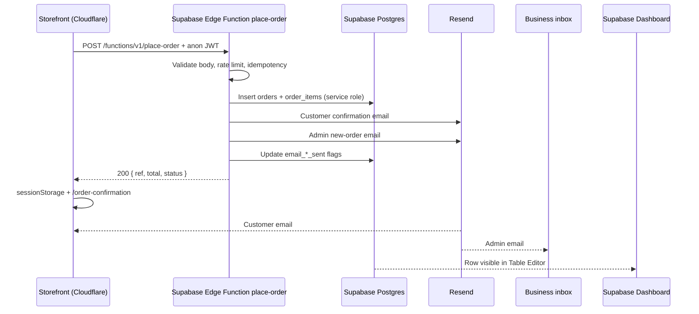

# Order notifications plan — Nutra Elixoria (Supabase)

How customers receive a **confirmation email** after checkout, and how **you** (the business) are notified when a new order arrives — using **Supabase** for storage and server logic.

The React storefront can stay on **Cloudflare** (current deploy); Supabase is the backend only.

---

## 1. Current state (today)

| What happens now | Limitation |
|------------------|------------|
| Customer clicks **Place order** on `/checkout` | No server call |
| Order is saved only in the browser: `sessionStorage` key `ne_last_order` | Lost if they close the tab on another device |
| Customer sees `/order-confirmation` | Copy says “SMS/email shortly” but **nothing is sent** |
| Order reference is generated client-side: `NE-` + random 6 digits | Not stored in a database; you cannot look it up later |

Relevant code today:

- `src/routes/checkout.tsx` — `PLACE ORDER` writes to `sessionStorage` and navigates
- `src/routes/order-confirmation.tsx` — reads `ne_last_order`, clears cart

**Conclusion:** Email and alerts need a **trusted server step**. Supabase **Edge Functions** hold secrets (Resend API key); the browser only calls the function with checkout data.

---

## 2. Target behaviour

### Customer

1. Completes checkout (name, email, phone, address, payment method, cart).
2. Clicks **Place order**.
3. Sees confirmation page with order reference **only after** Supabase accepts the order.
4. Receives a confirmation email within a few minutes (sent from Edge Function via Resend).

### Business (you)

1. Get a **new-order alert** when the row is saved (same request as customer email).
2. Channels:
   - **Email** to your inbox (Resend from Edge Function)
   - **Supabase Dashboard** → Table Editor → `orders` (always available, no extra build)
   - **Realtime** (optional) — browser tab or future admin UI subscribes to `INSERT` on `orders`
   - **WhatsApp** (Phase C) — Edge Function calls Twilio / WhatsApp Business API

---

## 3. Recommended architecture (Supabase)



### Stack roles

| Piece | Role |
|-------|------|
| **Supabase Postgres** | Source of truth for every order |
| **Edge Function `place-order`** | Validation, totals, ref generation, DB write, emails |
| **Resend** (or SendGrid) | Transactional email (API key in Supabase secrets only) |
| **RLS** | Block public read/write on `orders`; only service role from Edge Function |
| **Cloudflare site** | UI only; `VITE_SUPABASE_URL` + `VITE_SUPABASE_ANON_KEY` in env |

### Why Edge Function, not direct client insert

- **Never** put Resend or service-role keys in the React bundle.
- Server-side validation matches checkout rules.
- One place to add Turnstile, idempotency, and spam protection.
- Anon key alone cannot insert orders if RLS denies `INSERT` for `anon`.

---

## 4. Supabase project setup

### 4.1 Create project

1. [supabase.com](https://supabase.com) → New project (e.g. `nutra-elixoria`).
2. Region: choose closest to Pakistan (e.g. `ap-south-1` Mumbai or `eu-central-1` if preferred).
3. Save **Project URL** and **anon public** key for the frontend.
4. Save **service_role** key only for Edge Functions / local scripts — never commit to git or Vite env.

### 4.2 Frontend env (Cloudflare / Vite)

```bash
# .env.local — safe to expose in client
VITE_SUPABASE_URL=https://xxxxxxxx.supabase.co
VITE_SUPABASE_ANON_KEY=eyJhbGciOiJIUzI1NiIsInR5cCI6IkpXVCJ9...
```

### 4.3 Edge Function secrets

In Supabase Dashboard → **Edge Functions** → Secrets (or CLI `supabase secrets set`):

```bash
RESEND_API_KEY=re_...
ORDER_FROM_EMAIL=orders@nutraelixoria.com
ORDER_NOTIFY_EMAIL=you@example.com
SUPABASE_SERVICE_ROLE_KEY=eyJ...   # auto-injected in hosted functions; set for local invoke
```

---

## 5. Database schema (Postgres)

Run in **SQL Editor** or `supabase/migrations/001_orders.sql`:

```sql
-- Order reference sequence (optional cleaner refs)
CREATE SEQUENCE IF NOT EXISTS order_ref_seq START 100000;

CREATE TABLE public.orders (
  id UUID PRIMARY KEY DEFAULT gen_random_uuid(),
  ref TEXT UNIQUE NOT NULL,
  idempotency_key TEXT UNIQUE,
  created_at TIMESTAMPTZ NOT NULL DEFAULT now(),
  status TEXT NOT NULL DEFAULT 'received'
    CHECK (status IN ('received', 'processing', 'shipped', 'cancelled')),
  customer_name TEXT NOT NULL,
  customer_email TEXT NOT NULL,
  customer_phone TEXT NOT NULL,
  address JSONB NOT NULL,
  payment_method TEXT NOT NULL CHECK (payment_method IN ('cod', 'bank')),
  subtotal INTEGER NOT NULL,
  discount INTEGER NOT NULL DEFAULT 0,
  total INTEGER NOT NULL,
  email_customer_sent BOOLEAN NOT NULL DEFAULT false,
  email_admin_sent BOOLEAN NOT NULL DEFAULT false
);

CREATE TABLE public.order_items (
  id BIGSERIAL PRIMARY KEY,
  order_id UUID NOT NULL REFERENCES public.orders(id) ON DELETE CASCADE,
  product_id TEXT NOT NULL,
  name TEXT NOT NULL,
  price INTEGER NOT NULL,
  compare_at INTEGER,
  quantity INTEGER NOT NULL CHECK (quantity > 0),
  image TEXT
);

CREATE INDEX orders_created_at_idx ON public.orders (created_at DESC);
CREATE INDEX orders_ref_idx ON public.orders (ref);

-- RLS: no public access; Edge Function uses service role
ALTER TABLE public.orders ENABLE ROW LEVEL SECURITY;
ALTER TABLE public.order_items ENABLE ROW LEVEL SECURITY;

-- Optional: authenticated admin role later
-- CREATE POLICY admin_read_orders ON public.orders FOR SELECT TO authenticated USING (true);
```

**Generate `ref` in Edge Function**, e.g. `NE-` + `nextval('order_ref_seq')` or `NE-2026-` + random digits.

### How you see orders in Supabase

| Method | How |
|--------|-----|
| **Table Editor** | Dashboard → Table Editor → `orders` / `order_items` |
| **SQL** | `SELECT * FROM orders ORDER BY created_at DESC LIMIT 50;` |
| **Admin email** | Same moment as insert (Edge Function) |
| **Realtime** (optional) | Enable replication on `orders`; subscribe in a future `/admin` page |

---

## 6. Edge Function: `place-order`

**Path:** `supabase/functions/place-order/index.ts`

**Flow:**

1. `OPTIONS` → CORS headers for your site origin.
2. Parse JSON body; validate with Zod (same fields as checkout).
3. Check `Idempotency-Key` header → if `orders.idempotency_key` exists, return existing order.
4. Compute `subtotal`, `discount`, `total` from items (`compareAt` vs `price`).
5. Create Supabase client with **service role** → insert `orders` + `order_items` in a transaction (or single RPC).
6. Call Resend twice (customer + `ORDER_NOTIFY_EMAIL`); set `email_*_sent` on success.
7. Return `{ ref, total, status: 'received' }`.

**Invoke from React:**

```ts
import { createClient } from "@supabase/supabase-js";

const supabase = createClient(
  import.meta.env.VITE_SUPABASE_URL,
  import.meta.env.VITE_SUPABASE_ANON_KEY,
);

const { data, error } = await supabase.functions.invoke("place-order", {
  body: { customer, payment, items },
  headers: { "Idempotency-Key": idempotencyKey },
});
```

Deploy: `supabase functions deploy place-order --no-verify-jwt` is **not** recommended for production; use **JWT verify** and allow `anon` role, or protect with a custom header + secret. Safer pattern:

- Deploy with JWT verification (default).
- Client passes anon key automatically via `supabase.functions.invoke`.
- Function checks origin / rate limit internally.

**CORS:** set `Access-Control-Allow-Origin` to your production domain (and `localhost` in dev).

---

## 7. API contract (Edge Function body)

Same payload as before; server computes money fields and `ref`.

### Request

```json
{
  "customer": {
    "fullName": "string",
    "email": "string",
    "phone": "string",
    "address1": "string",
    "address2": "string | optional",
    "city": "string",
    "province": "string",
    "postal": "string"
  },
  "payment": "cod | bank",
  "items": [
    {
      "id": "glutage-50ml",
      "name": "GLUTAGE",
      "price": 6000,
      "compareAt": 6500,
      "quantity": 1,
      "image": "https://..."
    }
  ]
}
```

### Response `200`

```json
{
  "ref": "NE-482917",
  "total": 6000,
  "status": "received"
}
```

### Errors

| Code | Meaning |
|------|---------|
| `400` | Validation failed |
| `409` | Duplicate idempotency key (return existing order in body if useful) |
| `429` | Rate limited |
| `500` | Generic message to user; log in Supabase Function logs |

---

## 8. Implementation phases

### Phase A — MVP (Supabase + email)

| Step | Task |
|------|------|
| A1 | Create Supabase project; run migration `001_orders.sql`. |
| A2 | Scaffold `supabase/functions/place-order` (Deno + Zod + `@supabase/supabase-js`). |
| A3 | Set secrets: `RESEND_API_KEY`, `ORDER_FROM_EMAIL`, `ORDER_NOTIFY_EMAIL`. |
| A4 | Deploy function; test with `curl` or Supabase dashboard. |
| A5 | Add `src/lib/supabase.ts` + `src/lib/orders.ts` (`placeOrder()`). |
| A6 | Wire `checkout.tsx` **Place order** → `placeOrder()` → then `sessionStorage` + navigate. |
| A7 | Verify row in Table Editor + both emails. |

### Phase B — Reliability

| Step | Task |
|------|------|
| B1 | `idempotency_key` column + header on client. |
| B2 | If Resend fails after DB insert: leave `email_*_sent = false`; **pg_cron** or scheduled Edge Function `retry-emails` reads unsent rows. |
| B3 | Rate limit: count recent orders by IP in Edge Function (KV optional) or use Supabase + small `rate_limits` table. |
| B4 | Cloudflare **Turnstile** token in body; verify in Edge Function. |

### Phase C — Operations

| Step | Task |
|------|------|
| C1 | Supabase Auth + email allowlist → simple `/admin/orders` using anon + RLS policy for `authenticated` admins only. |
| C2 | Realtime subscription for new orders on admin page. |
| C3 | WhatsApp alert from Edge Function (optional). |
| C4 | Database webhook → Make/Zapier → Google Sheet (no code). |

---

## 9. Email content

Unchanged from transactional best practice; sent from **Resend inside Edge Function**.

### 9.1 Customer confirmation

| Field | Content |
|-------|---------|
| From | `Nutra Elixoria <orders@nutraelixoria.com>` |
| To | Customer email from checkout |
| Subject | `Your Nutra Elixoria order #{{ref}} is confirmed` |

Sections: thank you + ref, line items, discount/total, address, COD/bank, 2–5 day delivery, support/WhatsApp footer. HTML + plain text.

### 9.2 Internal new-order alert

| Field | Content |
|-------|---------|
| To | `ORDER_NOTIFY_EMAIL` |
| Subject | `[NEW ORDER] #{{ref}} — {{customerName}} — Rs. {{total}}` |

Include phone, address, payment, items, `created_at` (PKT). Optional `Reply-To: customer@email`.

### Resend setup

1. Verify domain `nutraelixoria.com` (DNS can stay on Cloudflare).
2. API key → Supabase Edge Function secret only.
3. Example inside `place-order`:

```ts
await fetch("https://api.resend.com/emails", {
  method: "POST",
  headers: {
    Authorization: `Bearer ${Deno.env.get("RESEND_API_KEY")}`,
    "Content-Type": "application/json",
  },
  body: JSON.stringify({
    from: Deno.env.get("ORDER_FROM_EMAIL")!,
    to: [order.customer_email],
    subject: `Your order #${order.ref} is confirmed`,
    html: renderCustomerEmail(order),
  }),
});
```

**Note:** Supabase does not replace Resend for custom HTML order emails. [Supabase Auth email](https://supabase.com/docs/guides/auth/auth-email) is only for magic links / auth, not shop confirmations.

---

## 10. How you know an order is coming

| Method | When |
|--------|------|
| **Admin email** (Resend) | Immediate; full detail |
| **Supabase Table Editor** | Immediate; filter/sort/export |
| **SQL / Reports** | Daily exports, dashboards |
| **Realtime** | Optional live feed in admin UI |
| **Database Webhook** | POST to Zapier/Make on `INSERT` → Slack, Sheet, etc. |
| **Edge Function logs** | Debug failed email or validation |

**Recommended for launch:** Edge Function emails + check **Supabase `orders` table** as backup.

---

## 11. Frontend changes

| File | Change |
|------|--------|
| `package.json` | Add `@supabase/supabase-js` |
| `src/lib/supabase.ts` (new) | `createClient` singleton |
| `src/lib/orders.ts` (new) | `placeOrder(payload, idempotencyKey)` → `functions.invoke` |
| `src/routes/checkout.tsx` | Async submit, loading/error states |
| `src/routes/order-confirmation.tsx` | Keep `sessionStorage`; store server `ref` + totals |

Do not navigate to confirmation until `place-order` succeeds.

---

## 12. Security and compliance

| Topic | Approach |
|-------|----------|
| Secrets | Only in Supabase Edge secrets / service role |
| RLS | Deny all on `orders` / `order_items` for `anon` and `authenticated` until admin policies exist |
| Client keys | Only `VITE_SUPABASE_URL` + anon key (expected public) |
| Validation | Zod in Edge Function; never trust client totals |
| Spam | Turnstile + rate limit + optional honeypot |
| PII | Postgres retention policy; export/delete on request |

---

## 13. Testing plan

| Test | Expected |
|------|----------|
| Happy path COD | 200, confirmation page, row in Supabase, 2 emails |
| Invalid email | 400, stay on checkout |
| Double-click | One row (`idempotency_key`) |
| Resend failure | Row exists, `email_customer_sent = false`, retry job fixes |
| RLS | Direct insert from browser with anon key **fails** |

Local: `supabase start` + `supabase functions serve place-order --env-file .env.local`.

---

## 14. Effort estimate

| Phase | Rough effort |
|-------|----------------|
| A — Supabase project, migration, Edge Function, Resend, checkout | 1–2 days |
| B — Idempotency, retry, rate limit, Turnstile | 0.5–1 day |
| C — Admin UI + Realtime + WhatsApp | 2–4 days |

---

## 15. Next code tasks

1. `npm install @supabase/supabase-js`
2. `supabase init` in repo; add `supabase/migrations/001_orders.sql`
3. Implement `supabase/functions/place-order/index.ts`
4. `supabase db push` + `supabase functions deploy place-order`
5. Set Edge secrets + Vite env vars on Cloudflare Pages
6. Update `checkout.tsx` Place order handler
7. End-to-end test order → Supabase row + inbox

---

## 16. Cloudflare + Supabase together

| Layer | Host |
|-------|------|
| React / TanStack Start storefront | Cloudflare (current `wrangler.jsonc`) |
| Postgres, Auth, Realtime, Edge Functions | Supabase |
| Email | Resend (called from Supabase Edge Function) |
| DNS for shop + email domain | Cloudflare |

No conflict: the browser calls `https://<project>.supabase.co/functions/v1/place-order` from your Cloudflare-hosted site.

---

*Document version: 2026-05-17 — Supabase backend (Postgres + Edge Functions + Resend). Storefront remains client-only until Phase A is implemented.*
